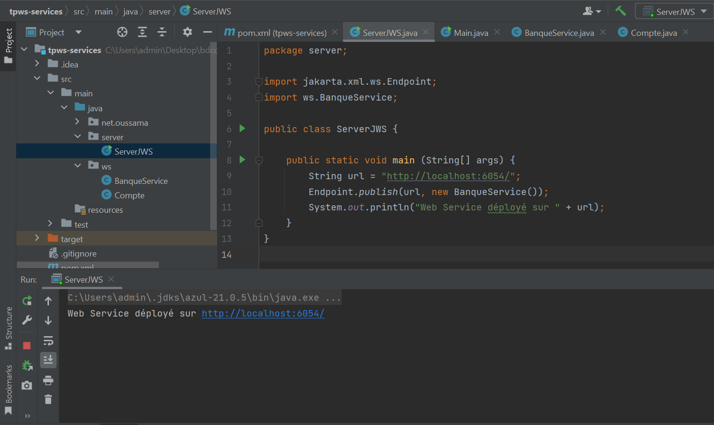
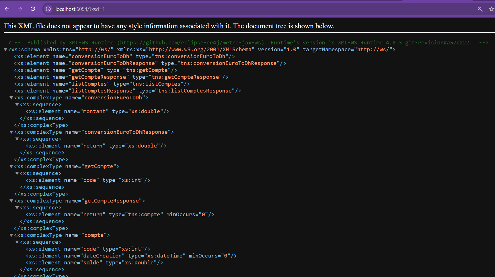
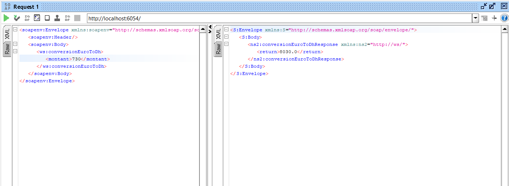
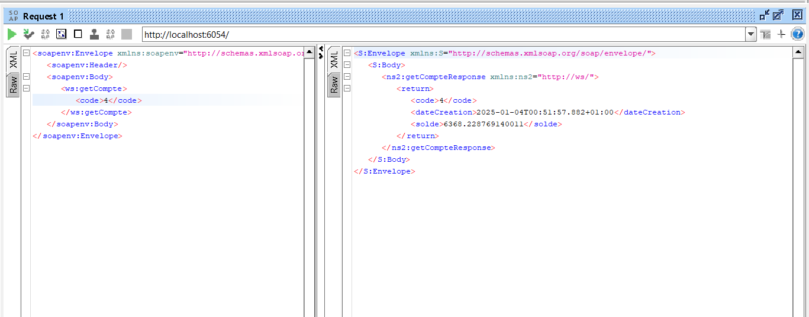
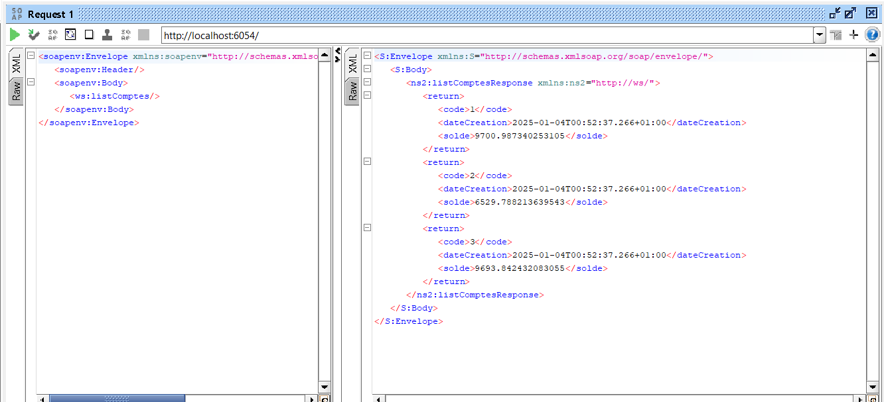
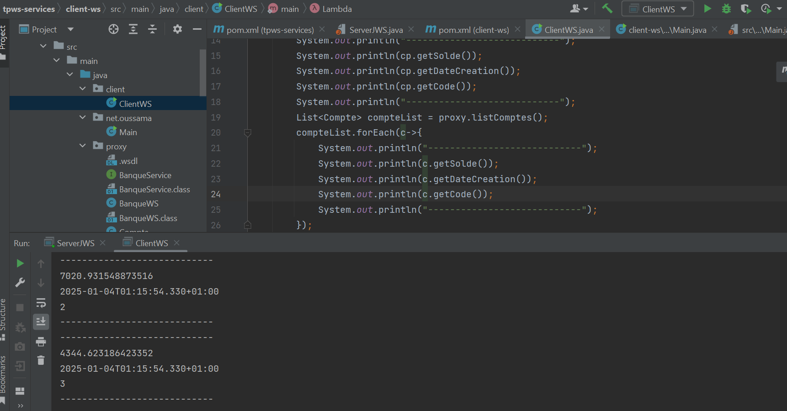
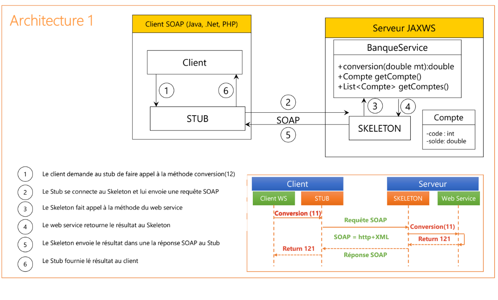

# Web Service SOAP: Conversion de Monnaie et Consultation de Comptes

## Description
Ce projet implémente un Web Service SOAP permettant de :
- Convertir des montants d'Euro (EUR) en Dirhams marocains (MAD).
- Consulter des informations sur un compte bancaire spécifique.
- Consulter une liste de comptes bancaires.

## Fonctionnalités

- Déploiement du Web Service avec un Serveur **JaxWS** : Déploiement du Web Service sur un serveur JaxWS simple pour l'accessibilité via le protocole SOAP.

  
  
- Consultation et analyse du WSDL avec un navigateur **HTTP** : Accéder au fichier WSDL du service pour en analyser la structure et la conformité via un navigateur HTTP.

  

- Conversion de monnaie (EUR → MAD).

  

- Consultation d'un compte.

  

- Consultation de la liste des comptes.

  

- Création d'un Client SOAP Java** : Développement d'un client SOAP en **Java** pour interagir avec le Web service en utilisant **JAX-WS**.

  

## Étapes du Projet
1. Création du Web Service SOAP avec JAX-WS.
2. Déploiement sur un serveur JaxWS simple.
3. Analyse du WSDL via un navigateur HTTP.
4. Tests avec SoapUI ou Oxygen.
5. Développement d'un Client SOAP en Java.
6. Déploiement du Web Service dans un projet Spring Boot.

## Déploiement
Le projet est déployé via un serveur JAX-WS simple et peut être intégré dans un projet **Spring Boot** pour une gestion plus fluide des dépendances et du déploiement.

## Prérequis
- Java 8 ou supérieur.
- Maven pour la gestion des dépendances.
- Outils comme **SoapUI** pour les tests.
- Serveur Spring Boot (facultatif pour déploiement).

## Installation
1. Clonez ce repository.
2. Utilisez Maven pour compiler et exécuter le projet.
3. Accédez au fichier WSDL via un navigateur HTTP à l'adresse suivante : `http://localhost:6054/?wsdl`.

## Clients
Des clients SOAP en **Java** sont inclus pour interagir avec le service.

